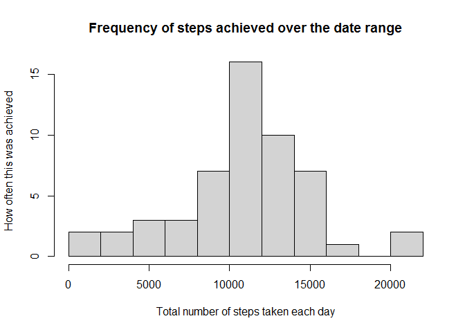
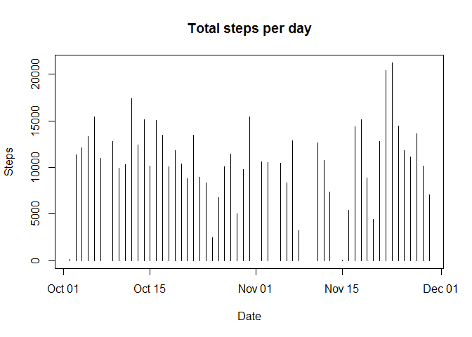
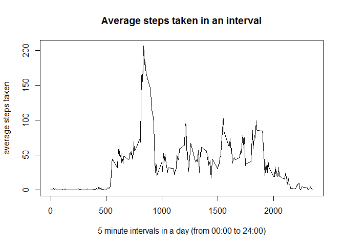
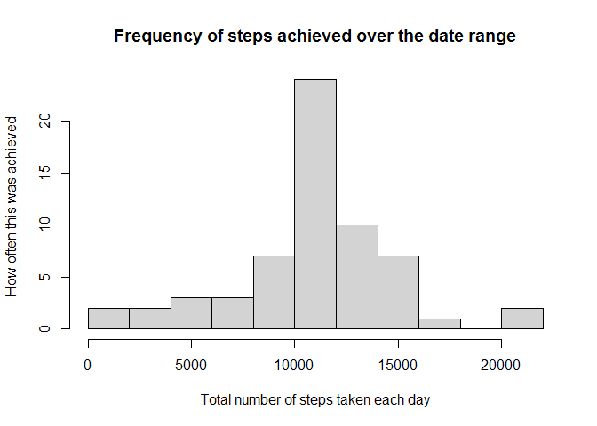
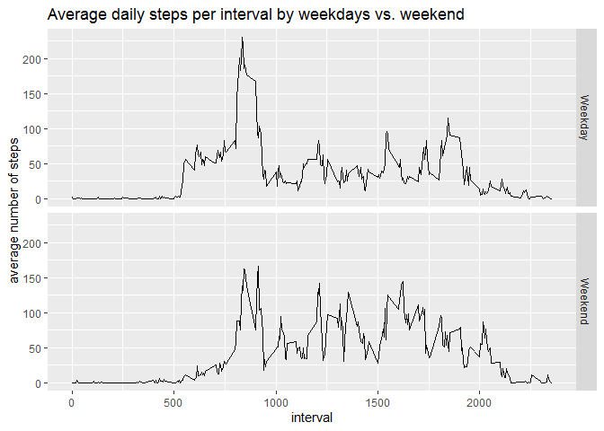

By:     C Zingler 
Date:   05-09-2020

## Loading and preprocessing the data

```r
## for reproducibility let set a seed
set.seed(54321)
## also load the required packages, if not already installed - they are required to be installed
## prior to loading

require(ggplot2)
require(readr)
require(lubridate)
require(tidyverse)


## download the relevant data, if it does not already exist for processing on the local machine


if(!file.exists("activity.zip")){download.file("http://d396qusza40orc.cloudfront.net/repdata%2Fdata%2Factivity.zip","activity.zip")}

## Unzip and read data into local variable
activity_data <- readr::read_csv(unzip("activity.zip","activity.csv"))
```

```
## Parsed with column specification:
## cols(
##   steps = col_double(),
##   date = col_date(format = ""),
##   interval = col_double()
## )
```


## What is mean total number of steps taken per day?

```r
## To do this we need to aggregate the data intervals by date, this remove all the NA values as they 
## will be ignored, and the dates they are recorded excluded from the aggregate

steps_by_day <- aggregate(steps~date,activity_data,sum)
## the Mean steps taken per day
msteps <- mean(steps_by_day$steps)
## and the median steps per day
medsteps<- median(steps_by_day$steps)
```
So the Mean number of steps taken every day in this data set is:

```r
msteps
```

```
## [1] 10766.19
```
and the Median number of steps taken every day in this data set is:

```r
medsteps
```

```
## [1] 10765
```
I will now present a Histogram of the steps taken each day, this will give us a frequency
distribution of steps across the days of the data set.  

Since the days in question are actually categorical data, I would also like to present a Bar plot
which will show the number of steps taken per day, over the time frame of the data set.  

Histogram: (this represents the frequency of the total steps achieved).  

```r
hist(steps_by_day$steps, xlab = "Total number of steps taken each day", ylab = "How often this was achieved ", main = "Frequency of steps achieved over the date range", breaks = 10)
```

<!-- -->
  

Barplot:  (this represents the the total steps achieved each day this was recorded).

```r
plot(steps_by_day$date,steps_by_day$steps,type = "h", xlab = "Date", ylab = "Steps", main = "Total steps per day")
```

<!-- -->


## What is the average daily activity pattern?

```r
## so we get the mean of the aggregated intervals
averagestepsbyinterval<- aggregate(activity_data$steps~activity_data$interval,activity_data,mean)
```
  

Let us do a time series plot of the average steps over all intervals  
  


```r
## and now we plot average steps over all intervals
plot(averagestepsbyinterval$`activity_data$interval`,averagestepsbyinterval$`activity_data$steps`, type = "l" ,xlab = "5 minute intervals in a day (from 00:00 to 24:00)", ylab = "average steps taken", main = "Average steps taken in an interval")
```

<!-- -->

  
Let us find the average maximum steps over the day, and find the interval this falls in.


```r
##so the average Maximum steps are
max(averagestepsbyinterval$`activity_data$steps`)
```

```
## [1] 206.1698
```

```r
## to find the interval where this occurs we have to find its row
 which.max(averagestepsbyinterval$`activity_data$steps`)
```

```
## [1] 104
```
**So the interval where the maximum average occurs across the 61 day sample is**
 

```r
 ## So this interval is 
averagestepsbyinterval$`activity_data$interval`[which.max(averagestepsbyinterval$`activity_data$steps`)] 
```

```
## [1] 835
```

## Imputing missing values
The number of Rows in the data set that are NA are:

```r
## number of NA step values
sum(is.na(activity_data))
```

```
## [1] 2304
```
**So lets impute the step values by using the means of the averaged daily intervals we derived earlier**


```r
## so to impute these missing values We need to load a new column for the imputed data this will be a 
## 3 step process, to mutate a new numeric variable of type double. Then running Mutate again 
## to fill the variable with the appropriate values, and then a copy back to make a newly imputed 
## version of the original data

imputed_activity_data <- activity_data


imputed_activity_data1<-  mutate(imputed_activity_data, rmv_na_steps= 0)

imputed_activity_data1 <- mutate(imputed_activity_data1, "rmv_na_steps" =  if_else(is.na(imputed_activity_data1$steps),round(averagestepsbyinterval$`activity_data$steps` [match(imputed_activity_data1$interval, averagestepsbyinterval$`activity_data$interval` )],0), imputed_activity_data1$steps))

imputed_activity_data$steps <- imputed_activity_data1$rmv_na_steps
## to show this lets run head and tail

head(imputed_activity_data, 10)
```

```
## # A tibble: 10 x 3
##    steps date       interval
##    <dbl> <date>        <dbl>
##  1     2 2012-10-01        0
##  2     0 2012-10-01        5
##  3     0 2012-10-01       10
##  4     0 2012-10-01       15
##  5     0 2012-10-01       20
##  6     2 2012-10-01       25
##  7     1 2012-10-01       30
##  8     1 2012-10-01       35
##  9     0 2012-10-01       40
## 10     1 2012-10-01       45
```

```r
tail(imputed_activity_data, 10)
```

```
## # A tibble: 10 x 3
##    steps date       interval
##    <dbl> <date>        <dbl>
##  1     0 2012-11-30     2310
##  2     1 2012-11-30     2315
##  3     1 2012-11-30     2320
##  4     2 2012-11-30     2325
##  5     3 2012-11-30     2330
##  6     5 2012-11-30     2335
##  7     3 2012-11-30     2340
##  8     1 2012-11-30     2345
##  9     0 2012-11-30     2350
## 10     1 2012-11-30     2355
```
So let us create a new daily data set equal to the original, but with the missing data filled in


```r
imp_steps_by_day <- aggregate(steps~date,imputed_activity_data,sum)
head(imp_steps_by_day)
```

```
##         date steps
## 1 2012-10-01 10762
## 2 2012-10-02   126
## 3 2012-10-03 11352
## 4 2012-10-04 12116
## 5 2012-10-05 13294
## 6 2012-10-06 15420
```
So let us use this complete daily data to make a histogram


```r
hist(imp_steps_by_day$steps, xlab = "Total number of steps taken each day", ylab = "How often this was achieved ", main = "Frequency of steps achieved over the date range", breaks = 10)
```

<!-- -->
  

This Histogram looks virtually the same as the previous plot
now lets check the median and mean.
*Mean

```r
mimpsteps <- mean(imp_steps_by_day$steps)

mimpsteps
```

```
## [1] 10765.64
```
*median


```r
medimpsteps<- median(imp_steps_by_day$steps)

medimpsteps
```

```
## [1] 10762
```
*so the median and the mean of the imputed data are very close to the same figures, as the non-imputed.*
We have included the extra 8 days of missing data, and hopefully reduced any bias in do in so.

## Are there differences in activity patterns between weekdays and weekends?

To determine this we will have to add a weekday/weekend factor variable to the data, so we may compare them.


```r
##so we need to separate or imputed data into weekday and weekends
imputed_activity_data2 <-  mutate(imputed_activity_data, dayType = if_else(weekdays(imputed_activity_data$date)=="Saturday" |weekdays(imputed_activity_data$date)=="Sunday", "Weekend","Weekday" ))

## let us check new variable
head(imputed_activity_data2)
```

```
## # A tibble: 6 x 4
##   steps date       interval dayType
##   <dbl> <date>        <dbl> <chr>  
## 1     2 2012-10-01        0 Weekday
## 2     0 2012-10-01        5 Weekday
## 3     0 2012-10-01       10 Weekday
## 4     0 2012-10-01       15 Weekday
## 5     0 2012-10-01       20 Weekday
## 6     2 2012-10-01       25 Weekday
```

```r
##so now to aggregate for plot
averagestepsbyinterval1<- aggregate(imputed_activity_data2$steps~imputed_activity_data2$interval+ imputed_activity_data2$dayType,imputed_activity_data2,mean)

astepintday <- averagestepsbyinterval1
## simplify column names
astepintday<- rename(astepintday, interval='imputed_activity_data2$interval' ,dayType='imputed_activity_data2$dayType', steps='imputed_activity_data2$steps')
```
So now we make a panel plot

```r
panplot <- ggplot(astepintday, aes(x=interval,y=steps, group=dayType)) + geom_line()  +  labs(title = "Average daily steps per interval by weekdays vs. weekend", x = "interval", y= "average number of steps")+ facet_grid(dayType ~ .)


panplot
```

<!-- -->
